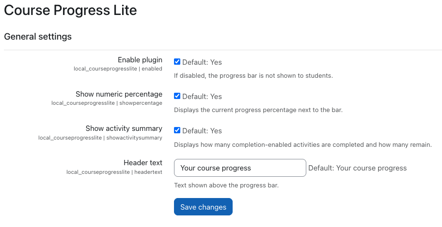

# Course Progress Lite - User and Admin Manual (English)

## Overview

`local_courseprogresslite` provides a compact course progress bar for Moodle course pages.
This distribution package ships with English strings only for Moodle plugin directory compliance.

## Repository

- GitHub: https://github.com/antoniomexdf-boop/moodle-local_courseprogresslite

## Author and Contact

- Author: Jesus Antonio Jimenez Avina
- Email: antoniomexdf@gmail.com

## Features

- Simple progress bar and optional percentage
- Optional activity summary with completed and remaining counts
- Moodle completion tracking as the only progress source
- Configurable header text
- Global plugin enable or disable
- Mustache-based frontend rendering with AMD build files
- No pending-actions timeline or advanced Pro-only interactions

## Student Experience

Students see a simple progress bar with no edition label in the course interface.
The percentage follows Moodle completion-enabled activities only.
Activities without completion tracking are ignored by the Lite bar.
When enabled by the administrator, the widget also shows completed and remaining activity counts.

## Requirements

- Moodle 4.1+

## Installation

1. Copy plugin into `moodle/local/courseprogresslite`.
2. Complete installation as admin.
3. Purge caches.

## Configuration

Path:
`Site administration > Plugins > Local plugins > Course Progress Lite`

Available settings:

- Enable plugin
- Show numeric percentage
- Show activity summary
- Header text

## Screenshots

## Privacy

No personal data is stored.

## Release

- Release: `1.0.15 Lite`
- Version: `2026031702`

## Screenshot Guide

1. `courseprogresslite_01.png`
Shows the plugin configuration page with the Lite admin settings, including the activity-summary toggle.

2. `courseprogresslite_02.png`
Shows the student-facing Lite progress widget with the percentage, completed activities count, and remaining activities count.
