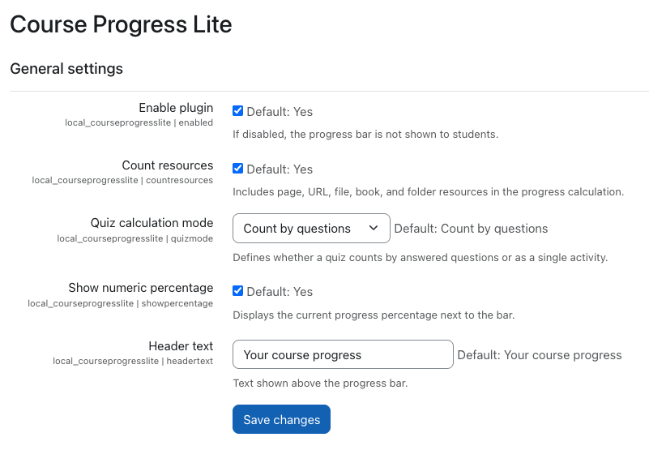

# Course Progress Lite (`local_courseprogresslite`)

Course Progress Lite is a Moodle local plugin that displays a simple progress bar inside course pages.

## Repository

- GitHub: https://github.com/antoniomexdf-boop/moodle-local_courseprogresslite

## Author and Contact

- Author: Jesus Antonio Jimenez Avina
- Email: antoniomexdf@gmail.com
- Email (secondary): antoniojamx@gmail.com

## Documentation

- User manual (EN): `docs/MANUAL_EN.md`
- Manual de uso (ES): `docs/MANUAL_ES.md`
- GitHub publish guide (EN): `docs/GITHUB_PUBLISH_EN.md`
- Guia de publicacion en GitHub (ES): `docs/GITHUB_PUBLISH_ES.md`
- Moodle plugins checklist: `PUBLISHING.md`
- Documentation screenshots: `docs/screenshots/`

## Features

- Displays a course progress bar.
- Supports optional numeric percentage.
- Includes global setting to enable or disable the plugin.
- Includes configurable header text.

## Requirements

- Moodle 4.1+

## Installation

1. Copy folder `courseprogresslite` to `local/courseprogresslite`.
2. Go to `Site administration > Notifications`.
3. Complete upgrade.
4. Purge Moodle caches.

## License

GNU GPL v3 or later.

## Screenshots

